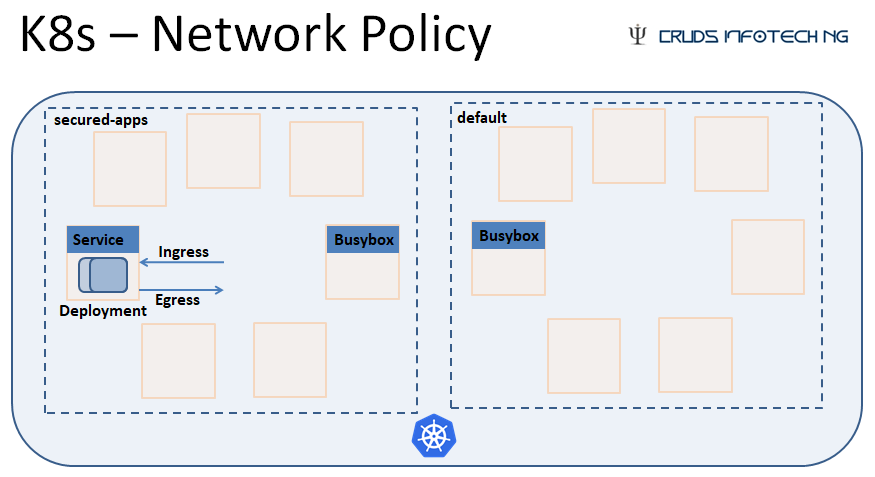

# K8s - Network Policy 

Demonstration of Network Policy Implementation in K8s cluster using Minikube 

### Demonstration 

### Minikube + Cilium 

	$minikube version
	minikube version: v1.10.1
	commit: 63ab801ac27e5742ae442ce36dff7877dcccb278

Stop & Delete previous versions/runs of Minikube (if any)

Start Minikube by enabling CNI & with required K8s version & VM Driver
Following command is for bringing up K8s version 1.18.0 on Windows, using virtualbox: 

	minikube start --vm-driver=virtualbox --network-plugin=cni --enable-default-cni --kubernetes-version v1.18.0

Install Cilium as DaemonSet in your Minikube:

	kubectl create -f https://raw.githubusercontent.com/cilium/cilium/HEAD/install/kubernetes/quick-install.yaml
	
	#Wait untill all required Cilium components come up & get to 'RUNNING STATE'
	kubectl -n kube-system get pods --watch	
	
YouTube Video Tutorial explaining this Demo : https://youtu.be/W3XKmny9JGM
